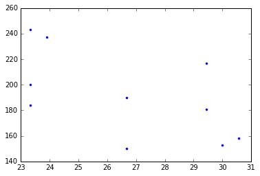
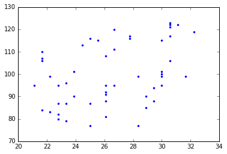
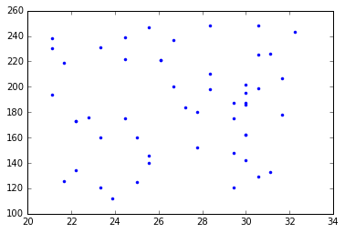

```python
import pandas
```


```python
type(pandas)
```


    module


```python
def fahr_to_celsius(temp_fahr):
    """Convert Fahrenheit to Celsius
    
    Return Celsius conversion of input"""
    temp_celsius = (temp_fahr - 32) * 5 / 9
    return temp_celsius
```


```python
fahr_to_celsius?
```


```python
data = pandas.read_csv("data/A1_mosquito_data.csv")
```


```python
data.head()
```


<div>
<table border="1" class="dataframe">
  <thead>
    <tr style="text-align: right;">
      <th></th>
      <th>year</th>
      <th>temperature</th>
      <th>rainfall</th>
      <th>mosquitos</th>
    </tr>
  </thead>
  <tbody>
    <tr>
      <th>0</th>
      <td>2001</td>
      <td>80</td>
      <td>157</td>
      <td>150</td>
    </tr>
    <tr>
      <th>1</th>
      <td>2002</td>
      <td>85</td>
      <td>252</td>
      <td>217</td>
    </tr>
    <tr>
      <th>2</th>
      <td>2003</td>
      <td>86</td>
      <td>154</td>
      <td>153</td>
    </tr>
    <tr>
      <th>3</th>
      <td>2004</td>
      <td>87</td>
      <td>159</td>
      <td>158</td>
    </tr>
    <tr>
      <th>4</th>
      <td>2005</td>
      <td>74</td>
      <td>292</td>
      <td>243</td>
    </tr>
  </tbody>
</table>
</div>


* since we have one row per year, let's set that to the index using .set_index()


```python
data = data.set_index("year")
```

* let's use the fahr_to_celsius() function to convert our fahr temp to celsisus on the fly (not saved)


```python
fahr_to_celsius(data["temperature"])
```


    year
    2001    26.666667
    2002    29.444444
    2003    30.000000
    2004    30.555556
    2005    23.333333
    2006    23.888889
    2007    26.666667
    2008    29.444444
    2009    23.333333
    2010    23.333333
    Name: temperature, dtype: float64


* in pandas one way to add a column is to assign our result to a new column using the bracket structure


```python
data["temperature_C"] = fahr_to_celsius(data["temperature"])
```


```python
data.head()
```


<div>
<table border="1" class="dataframe">
  <thead>
    <tr style="text-align: right;">
      <th></th>
      <th>temperature</th>
      <th>rainfall</th>
      <th>mosquitos</th>
      <th>temperature_C</th>
    </tr>
    <tr>
      <th>year</th>
      <th></th>
      <th></th>
      <th></th>
      <th></th>
    </tr>
  </thead>
  <tbody>
    <tr>
      <th>2001</th>
      <td>80</td>
      <td>157</td>
      <td>150</td>
      <td>26.666667</td>
    </tr>
    <tr>
      <th>2002</th>
      <td>85</td>
      <td>252</td>
      <td>217</td>
      <td>29.444444</td>
    </tr>
    <tr>
      <th>2003</th>
      <td>86</td>
      <td>154</td>
      <td>153</td>
      <td>30.000000</td>
    </tr>
    <tr>
      <th>2004</th>
      <td>87</td>
      <td>159</td>
      <td>158</td>
      <td>30.555556</td>
    </tr>
    <tr>
      <th>2005</th>
      <td>74</td>
      <td>292</td>
      <td>243</td>
      <td>23.333333</td>
    </tr>
  </tbody>
</table>
</div>


* we can now do some graphing


```python
%matplotlib inline
```


```python
import matplotlib.pyplot as plt
```


```python
plt.plot?
```


```python
plt.plot(data["temperature_C"], data["mosquitos"], ".")
plt.savefig("A1_mosquito_data_mosquitos_vs_tempC.png")
```





```python
!ls *png
```

    A1_mosquito_data_mosquitos_vs_tempC.png


```python

```


```python
!ls *csv
```

    A1_mosquito_data.csv   A2_mosquito_data_C.csv B1_mosquito_data.csv
    A2_mosquito_data.csv   A3_mosquito_data.csv   B2_mosquito_data.csv


* let's start thinking about building a function. 
* we can do better on the file name of the png
* we want it associated with the file it comes from


```python
a = "A2_mosquito_data.csv" #name of file we are plotting
```

* use the subset to grab 'A2_mosquito_data.' and add 'png' to it.


```python
a[0:-3]  + "png"
```


    'A2_mosquito_data.png'


```python
a[0:-4] + "_mosquitos_vs_tempC.png"
```


    'A2_mosquito_data_mosquitos_vs_tempC.png'


* we can use replace() to replace substring matches


```python
a.replace(".csv", ".png")
```


    'A2_mosquito_data.png'


### Let's take all the above and make a function.

Function does: 

1. load data
2. convert celsius
3. create the plot
4. save the plot to file


```python
def create_mosquitos_vs_tempC_plot(filename):
    # write processing here
    # load data
    print("Loading", filename)
    mosquitos_data = pandas.read_csv(filename)
    # convert celsius
    mosquitos_data["temperature_C"] = fahr_to_celsius(mosquitos_data["temperature"])
    # create the plot
    print("Plotting", filename)
    plt.plot(mosquitos_data["temperature_C"], mosquitos_data["mosquitos"], ".")
    # save the plot
    filename_png = filename[0:-4] + "_mosquitos_vs_tempC.png"
    plt.savefig(filename_png)
    print("Saving", filename_png)
    return filename_png
```


```python
name_of_png = create_mosquitos_vs_tempC_plot("A2_mosquito_data.csv")
```

    Loading A2_mosquito_data.csv
    Plotting A2_mosquito_data.csv
    Saving A2_mosquito_data_mosquitos_vs_tempC.png


```python
print(name_of_png)
!ls data/
```

    A2_mosquito_data_mosquitos_vs_tempC.png
    A1_mosquito_data.csv                    B1_mosquito_data.csv
    A2_mosquito_data.csv                    B1_mosquito_data_mosquitos_vs_tempC.png
    A2_mosquito_data_mosquitos_vs_tempC.png B2_mosquito_data.csv
    A3_mosquito_data.csv                    decision_tree_example.url


```python
create_mosquitos_vs_tempC_plot("B1_mosquito_data.csv")
```

    Loading B1_mosquito_data.csv
    Plotting B1_mosquito_data.csv
    Saving B1_mosquito_data_mosquitos_vs_tempC.png


    'B1_mosquito_data_mosquitos_vs_tempC.png'





```python
!ls *png
```

    A1_mosquito_data_mosquitos_vs_tempC.png B1_mosquito_data_mosquitos_vs_tempC.png
    A2_mosquito_data_mosquitos_vs_tempC.png


* let's alter the return statement to return the data 
* then we can write it out


```python
def create_mosquitos_vs_tempC_plot(filename):
    # write processing here
    # load data
    print("Loading", filename)
    mosquitos_data = pandas.read_csv(filename)
    # convert celsius
    mosquitos_data["temperature_C"] = fahr_to_celsius(mosquitos_data["temperature"])
    # create the plot
    print("Plotting", filename)
    plt.plot(mosquitos_data["temperature_C"], mosquitos_data["mosquitos"], ".")
    # save the plot
    filename_png = filename[0:-4] + "_mosquitos_vs_tempC.png"
    plt.savefig(filename_png)
    print("Saving", filename_png)
    return mosquitos_data
```


```python
mosquito_data_A2 = create_mosquitos_vs_tempC_plot("A2_mosquito_data.csv")
```

    Loading A2_mosquito_data.csv
    Plotting A2_mosquito_data.csv
    Saving A2_mosquito_data_mosquitos_vs_tempC.png





```python
mosquito_data_A2.to_csv("A2_mosquito_data_C.csv")
```


```python
mosquito_data_A2.head(6)
```


<div>
<table border="1" class="dataframe">
  <thead>
    <tr style="text-align: right;">
      <th></th>
      <th>year</th>
      <th>temperature</th>
      <th>rainfall</th>
      <th>mosquitos</th>
      <th>temperature_C</th>
    </tr>
  </thead>
  <tbody>
    <tr>
      <th>0</th>
      <td>1960</td>
      <td>82</td>
      <td>200</td>
      <td>180</td>
      <td>27.777778</td>
    </tr>
    <tr>
      <th>1</th>
      <td>1961</td>
      <td>70</td>
      <td>227</td>
      <td>194</td>
      <td>21.111111</td>
    </tr>
    <tr>
      <th>2</th>
      <td>1962</td>
      <td>89</td>
      <td>231</td>
      <td>207</td>
      <td>31.666667</td>
    </tr>
    <tr>
      <th>3</th>
      <td>1963</td>
      <td>74</td>
      <td>114</td>
      <td>121</td>
      <td>23.333333</td>
    </tr>
    <tr>
      <th>4</th>
      <td>1964</td>
      <td>78</td>
      <td>147</td>
      <td>140</td>
      <td>25.555556</td>
    </tr>
    <tr>
      <th>5</th>
      <td>1965</td>
      <td>85</td>
      <td>151</td>
      <td>148</td>
      <td>29.444444</td>
    </tr>
  </tbody>
</table>
</div>


```python
!head A2_mosquito_data_C.csv
```

    ,year,temperature,rainfall,mosquitos,temperature_C
    0,1960,82,200,180,27.77777777777778
    1,1961,70,227,194,21.11111111111111
    2,1962,89,231,207,31.666666666666668
    3,1963,74,114,121,23.333333333333332
    4,1964,78,147,140,25.555555555555557
    5,1965,85,151,148,29.444444444444443
    6,1966,86,172,162,30.0
    7,1967,75,106,112,23.88888888888889
    8,1968,70,276,230,21.11111111111111


```python
mosquito_data_A2.to_csv("A2_mosquito_data_C.csv", index=False)
```


```python
!head A2_mosquito_data_C.csv
```

    year,temperature,rainfall,mosquitos,temperature_C
    1960,82,200,180,27.77777777777778
    1961,70,227,194,21.11111111111111
    1962,89,231,207,31.666666666666668
    1963,74,114,121,23.333333333333332
    1964,78,147,140,25.555555555555557
    1965,85,151,148,29.444444444444443
    1966,86,172,162,30.0
    1967,75,106,112,23.88888888888889
    1968,70,276,230,21.11111111111111


### Let's make a python module!

* What's a [python module](http://programmers.stackexchange.com/questions/111871/module-vs-package)??
* Python module is simply a Python source file, which can expose classes, functions and global variables
* It's a python file .py with functions, etc.
* Let's take our existing functions and make a module (a file).


```python
!pwd
```

    /Users/jtdennis/Desktop/python-pandas


### Open up text editor:

1. On mac, use nano from command line (navigate to desktop folder containing your notebook and data)
2. On windows, use notepad.

import pandas
import matplotlib.pyplot as plt

def fahr_to_celsius(temp_fahr):
    """Convert Fahrenheit to Celsius
    
    Return Celsius conversion of input"""
    temp_celsius = (temp_fahr - 32) * 5 / 9
    return temp_celsius

def create_mosquitos_vs_tempC_plot(filename):
    """Create a png plot of mosquitos vs temp C

    Parameters
    ----------
    filename : string
        name of csv data file
    Returns
    -------
    mosquito_data : DataFrame
        Table with temp C column
    """
    # write processing here
    # load data
    print("Loading", filename)
    mosquitos_data = pandas.read_csv(filename)
    # convert celsius
    mosquitos_data["temperature_C"] = fahr_to_celsius(mosquitos_data["temperature"])
    # create the plot
    print("Plotting", filename)
    plt.plot(mosquitos_data["temperature_C"], mosquitos_data["mosquitos"], ".")
    # save the plot
    filename_png = filename[0:-4] + "_mosquitos_vs_tempC.png"
    plt.savefig(filename_png)
    print("Saving", filename_png)
    return mosquitos_data


```python
!cat analyze_mosquitos.py
```

    import pandas
    import matplotlib.pyplot as plt
    
    def fahr_to_celsius(temp_fahr):
        """Convert Fahrenheit to Celsius
        
        Return Celsius conversion of input"""
        temp_celsius = (temp_fahr - 32) * 5 / 9
        return temp_celsius
    
    def create_mosquitos_vs_tempC_plot(filename):
        '''Create a png plot of mosquitos vs temp C
    
        Parameters
        ----------
        filename : string
            name of csv data file
        Returns
        -------
        mosquito_data : DataFrame
            Table with temp C column
        '''
        # write processing here
        # load data
        print("Loading", filename)
        mosquitos_data = pandas.read_csv(filename)
        # convert celsius
        mosquitos_data["temperature_C"] = fahr_to_celsius(mosquitos_data["temperature"])
        # create the plot
        print("Plotting", filename)
        plt.plot(mosquitos_data["temperature_C"], mosquitos_data["mosquitos"], ".")
        # save the plot
        filename_png = filename[0:-4] + "_mosquitos_vs_tempC.png"
        plt.savefig(filename_png)
        print("Saving", filename_png)
        return filename_png


```python

```
